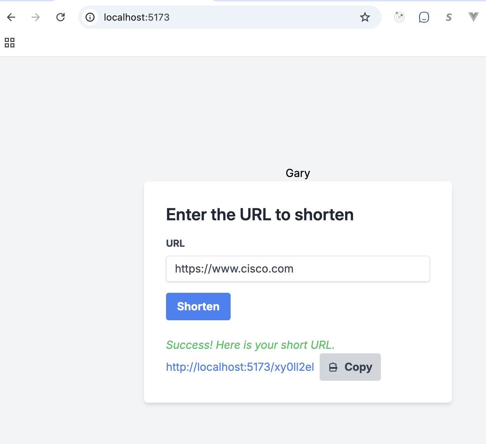
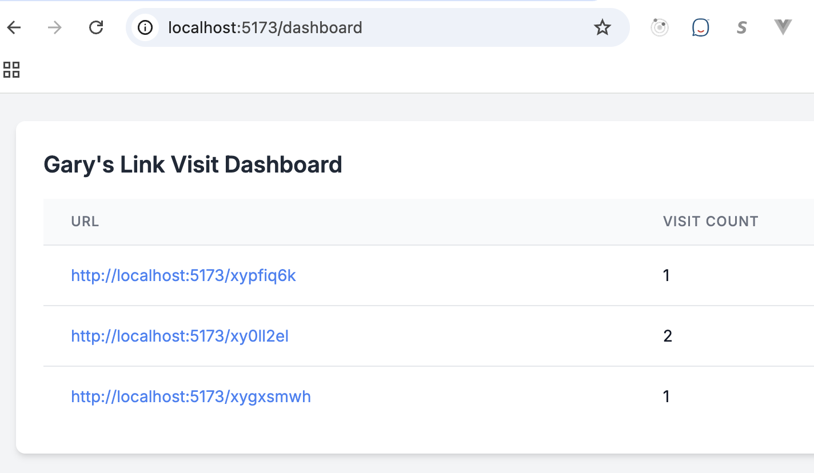
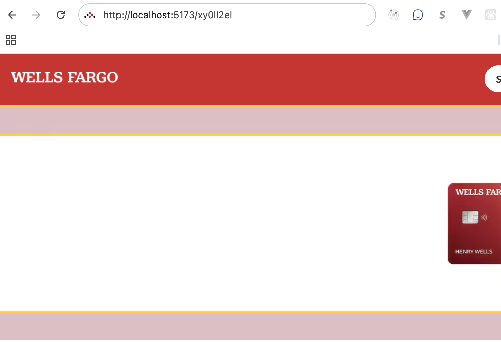

# URL Shortener Web Application

A modern web application built with React 19, React Router 7, Vite, and Express that shortens URLs.

## Features

- React 19 with latest features
- React Router 7 for modern routing
- Tailwind CSS for styling
- Express backend API
- Responsive design

## Prerequisites

- Node.js (v16 or higher)
- npm (v7 or higher)
- Docker (optional, for containerized deployment)

## Installation

1. Clone the repository
2. Install dependencies:
```bash
npm install
```

## Running the Application

### Development Mode

To run both the frontend and backend servers in development mode:

```bash
npm run dev
```

This will start:
- Frontend server at http://localhost:5173
- Backend server at http://localhost:3001

### Production Mode

To build and run the application in production mode:

1. Build the frontend:
```bash
npm run build
```

2. Start the production server:
```bash
npm start
```

## Docker Deployment

### Building the Docker Image

To build the Docker image:

```bash
docker build -t url-shortener-app .
```

### Running with Docker

To run the application using Docker:

```bash
docker run -p 3001:3001 url-shortener-app
```

### Using Docker Compose

To run the application using Docker Compose:

```bash
docker-compose up
```

To run in detached mode:

```bash
docker-compose up -d
```

To stop the application:

```bash
docker-compose down
```

## Project Structure

```
├── src/                    # Frontend source code
│   ├── components/        # React components
│   ├── App.jsx           # Main App component
│   └── main.jsx          # Application entry point
├── server/                # Backend server code
│   └── index.js          # Express server
├── public/               # Static assets
├── Dockerfile            # Docker configuration
├── docker-compose.yml    # Docker Compose configuration
└── package.json          # Project dependencies and scripts
```

## Technologies Used

- React 19
- React Router 7
- Vite
- Tailwind CSS
- Express
- Node.js
- Docker 


### Sample screenshots


Home page




The dashboard (/dashboard for the current user)




The short URL page (to track and redirect)



